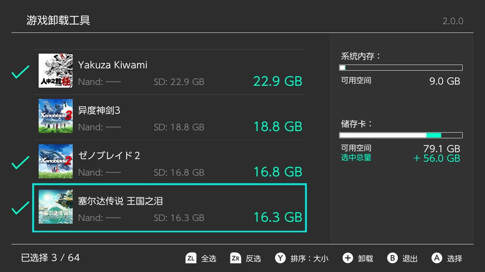
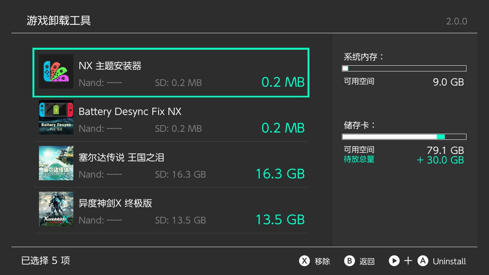
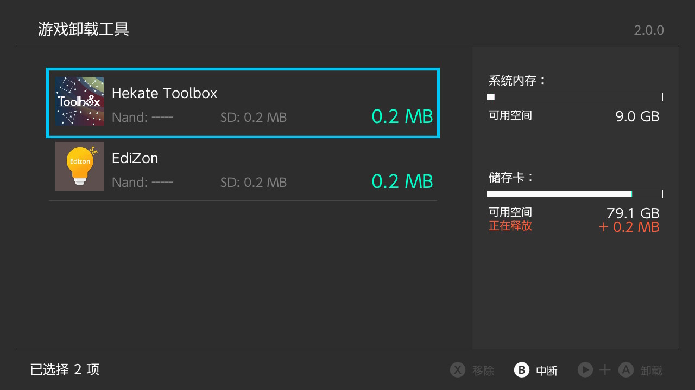
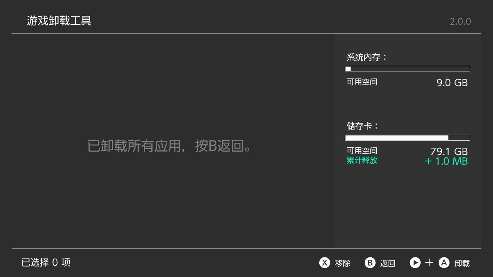

# untitled









感谢ITotalJustice的帮助。

Thanks to ITotalJustice for the help.

因为引入了libnxtc的缓存功能，如需编译本项目，需额外安装libnxtc库的支持。

Due to the introduction of libnxtc caching functionality, compiling this project requires additional installation of libnxtc library support.

- 安装libnxtc库 / Install libnxtc library
```shell
git clone https://github.com/ITotalJustice/libnxtc.git
cd libnxtc
make -j
make install
```
我并非程序员，代码水平可以忽略，全靠AI，主要是折腾着玩，项目代码质量非常低，能跑通我已经很开心了。发出来主要留个纪念。

I'm not a programmer, my coding skills are negligible, relying entirely on AI. This is mainly for fun, the project code quality is very low, and I'm happy if it just works. I just want to leave a mark.

多语言文件中，除了中文，都是机翻，因为我只会中文，如果你真的需要可以自己翻译assets/romfs/lang下的文件，再重新编译。

In the multi-language files, except for Chinese, all are machine translated because I only know Chinese. If you really need accurate translations, you can translate the files under assets/romfs/lang yourself and recompile.

以下内容为原本的README.md

The following content is from the original README.md

Batch title uninstaller for the Nintendo Switch


---

## Building

the following needs to be installed via dkp-pacman

- uam
- switch-glm
- libnx
- deko3d

```shell
sudo pacman -S uam switch-glm libnx deko3d
```

then download the repo using git (you can instead download the zip if you prefer)

```shell
git clone https://github.com/ITotalJustice/untitled.git
cd untitled
```

then build:

```shell
make -j
```
if you're having trouble building, feel free to open an issue!

---

## Credits

Special thank you to everyone that contributed to the following libs.

- [nanovg](https://github.com/memononen/nanovg)

- [libnx](https://github.com/switchbrew/libnx)

- [libnx for their default icon](https://github.com/switchbrew/libnx/blob/master/nx/default_icon.jpg)

- [deko3d by fincs](https://github.com/devkitPro/deko3d)

- [deko3d backend for nanovg by adubbz](https://github.com/Adubbz/nanovg-deko3d)

And thank you to following people that helped me out

- shchmue for RE'ing `nsCalculateApplicationOccupiedSize` struct for me!

- werwolv for helping me out with templates ^^

- TeJay for helping test the app and providing the screenshots
